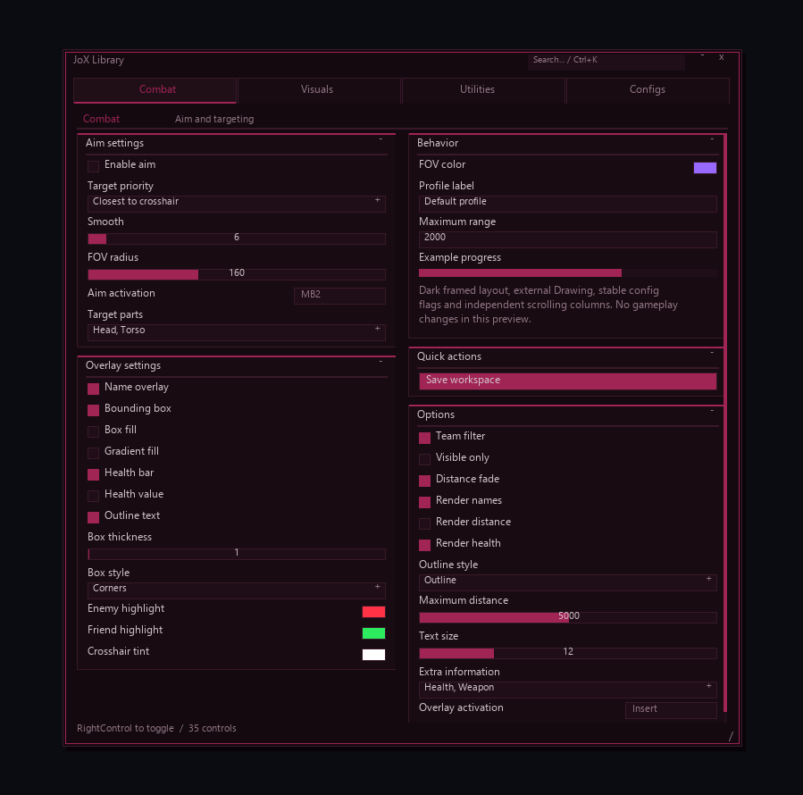
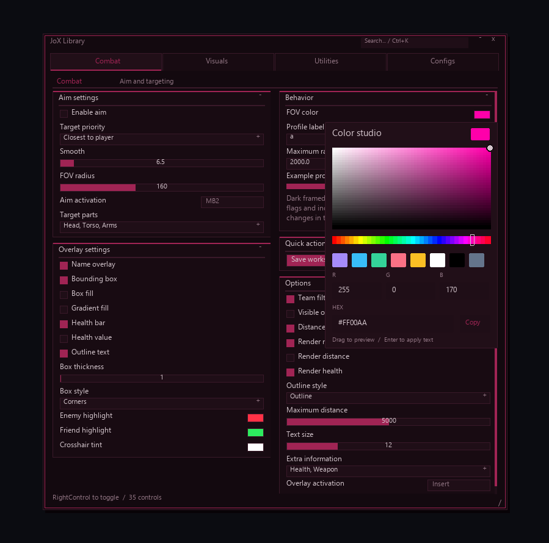

# JoX Library



# https://discord.gg/akgCMsmeuC

A reusable Lua 5.4 interface library for Jael X. It uses the app's native external Drawing primitives, not Roblox GUI instances. Compact wine-colored layout inspired by the supplied reference: horizontal tabs, fine borders, square checkboxes, filled sliders, two scrolling columns and floating popups. All existing builders, callbacks, handles and configuration flags are retained.

## Files and loading

- `JoX-Library.lua`: standalone library, returns `Library`.
- `examples/demo.lua`: component gallery loaded from GitHub; never changes gameplay.


Place the library in **Jael X's `script-data/JoX-Library.lua`**. Save the demo as a script in the app. The Lua filesystem API reads `script-data`, not arbitrary local paths.

```lua
local ok, Library = pcall(function()
	local src = buffer.tostring(fs.read_async("JoX-Library.lua"))
	local fn, err = loadstring(src)
	assert(fn, err)
	return fn()
end)
if not ok then
	warn("[MY_SCRIPT] UI unavailable: " .. tostring(Library))
	return -- Attach UI after your core starts so hotkeys can still work.
end
```

For a single loadstring-able file, embed the library inside a local function and call that function; the library itself has no dependencies beyond Jael X's Drawing API. A remote HTTP load can also be used once you publish the source to a URL you control.

### Loading from GitHub

Use the public raw source URL below. The file is plain Lua and returns the library table.

```lua
local ok, Library = pcall(function()
	local url = "https://raw.githubusercontent.com/TrollLexBR/Jael-X/main/JoX-Library.lua"
	local source = game:HttpGet(url)
	local fn, err = loadstring(source, "@JaelDrawingUI")
	assert(fn, err)
	local result = fn()
	assert(type(result) == "table" and result.NewWindow, "Invalid library response")
	return result
end)
if not ok then
	warn("[MY_SCRIPT] Could not load Drawing UI: " .. tostring(Library))
	return
end
```

Jael X performs this HTTP request outside Roblox. Use the direct `raw.githubusercontent.com` URL: automatic redirects are not followed by the documented `HttpGet` API. The repository must be publicly readable for a shared unauthenticated loader. Pin a Git commit in the URL instead of `main` when your scripts need a stable library version. 

## Minimal example

```lua
local window = Library:NewWindow({
	title = "My Hub", subtitle = "My game", configId = "my-hub",
	width = 880, height = 610,
	configAliases = { ["old/enabled"] = "aim/enabled" },
})
local tab = window:NewTab("Combat", "Aim settings")
local section = tab:NewSection("Aim", "left")
local enabled = section:AddToggle({
	text = "Enabled", flag = "aim/enabled", default = false,
	callback = function(value) print("[MY_SCRIPT] Enabled:", value) end,
})
enabled:SetValue(true) -- Fires the callback.
enabled:SetValue(false, true) -- Silent update.
```

## Windows, tabs and sections

| API | Behavior |
|---|---|
| `Library:NewWindow(opts)` / `:Window(opts)` | Multiple draggable, resizable windows. `title`, `subtitle`, `configId`, `x`, `y`, `width`, `height`, `configs`, `configAliases`. |
| `window:NewTab(title, description, opts?)` / `:Tab(...)` | Horizontal navigation. The optional tab metadata is retained; Configs stays last. Scroll the tab bar if it overflows. |
| `window:SetSearch(text)` / `:GetSearch()` | Filter the active page by section, control name and tooltip. Ctrl+K focuses search. |
| `window:ResetDefaults(includeAppearance?)` | Reset feature values and fire callbacks. Pass `true` to include Configs/appearance. |
| `tab:NewSection(title, column)` / `:Section(...)` | `left`, `right`, or `full`; do not mix full with side columns on a tab. |
| `tab:Select()` | Select a page and clear transient input. |
| `section:SetCollapsed(bool)` / `:SetVisible(bool)` | Control section layout. |
| `window:SetVisible(bool)` / `:Toggle()` / `:Remove()` | Hide, show, or remove a window. |
| `Library:SetVisible(bool)` / `:SetToggleKey(key)` | Global visibility and menu hotkey. Default: RightControl. |
| `Library:IsInteracting()` / `:IsMouseOverUI()` | Pause your own input features while users interact with the menu. |
| `Library:Unload()` | Disconnect every owned signal and clear windows/popups. Re-loading unloads the previous library. |

## Elements

Every builder takes an options table and returns a handle. Shared options: `text`, `flag`, `default`, `callback`, `tooltip`, `visible`, `disabled`, `fireOnInit`. Initial values do not fire callbacks unless `fireOnInit=true`.

| Builder | Specific options / value |
|---|---|
| `AddToggle` | Boolean. |
| `AddSlider` | `min`, `max`, optional `step`, `default`; finite numeric value, including zero and decimals. Drag, wheel, or click value to type. |
| `AddDropdown` | Nonempty `options`, `default`; selected string. |
| `AddMultiSelect` | `options`, `default` list; callback gets a copy of selected strings. |
| `AddInput` | `default`, `placeholder`, `maxLength`; `numeric=true` enables number validation with `min`, `max`, `step`. |
| `AddKeybind` | `default` key name/Enum.KeyCode or `MB1`/`MB2`/`MB3`; `mode="Toggle"`, `"Hold"`, or `"Press"`. `callback` receives activation state; `onChanged` receives a newly assigned key. |
| `AddColorPicker` | `default=Color3` or RGB list in 0–255; drag saturation/brightness and hue, pick swatches, edit RGB channels or `#RRGGBB`, copy HEX; callback receives Color3. |
| `AddButton` | `callback` runs on click; `style="secondary"`, `"primary"` or `"danger"`; no value. |
| `AddLabel` | Static `text` or dynamic `get=function() return text end`. |
| `AddParagraph` | Word-wrapped `text`. |
| `AddDivider` | Decorative separator. |
| `AddProgress` | `default` in 0–1 or dynamic `get`; `handle:SetValue(fraction)` updates static bars. |

`NewToggle`, `NewSlider`, `NewDropdown`, `NewInput`, `NewKeybind`, `NewColorPicker`, `NewButton`, `NewLabel`, `NewParagraph`, `NewDivider`, and `NewProgress` are aliases. `AddMultiSelect` is the multiselect builder.

Stateful handles expose `GetValue()` / `Get()`, `SetValue(value, silent)` / `Set(...)`, `SetText(text)`, `SetVisible(bool)`, `SetDisabled(bool)`, `SetTooltip(text)`, and `Remove()`. Stateful handles have `Reset(silent?)`; buttons have `SetStyle(style)`. Dropdowns also have `SetOptions(items, keepSelection)`. Keybinds have `SetKey(key)`, `SetMode(mode)`, and `GetState()`.

Text input supports Enter to apply, Escape to cancel, Ctrl+A, Ctrl+C, Ctrl+V and Backspace. Keyboard typing supports ASCII, including punctuation; paste accepts Unicode. Keybind capture uses Escape to cancel and Backspace/Delete to clear. Avoid binding the menu key to the same gameplay action.

## Configs and appearance

The automatic **Configs** tab is always last. It includes named config save/load/refresh/delete, JSON export, menu hotkey, notifications, rounding, and color pickers for accent, background, panels, headers, fields, borders, main text and secondary text.

`window:SaveConfig(name)` returns `ok, error`. `LoadConfig(name)` and `ImportConfig(json)` return the restored count and a list of rejected flags. `DeleteConfig(name)`, `ListConfigs()`, `ExportConfig()` are also available. Config import fires element callbacks; invalid values are rejected or bounded. Named profiles live together in `script-data/JaelUI/configs.json`, grouped by `configId`.

Use explicit stable flags to preserve settings when labels change. Pass `configAliases={oldFlag=newFlag}` to migrate old keys. Window position, dimensions, element values, keybind modes and the settings in Configs are saved. Configs load on user request; they are not automatically applied to a new script.

`Library:SetThemePreset(name)` applies Wine, Violet, Ocean, Emerald, Rose or Amber; Configs provides the same presets. Explicit custom colors survive saving/loading a profile. `Library:SetTheme({accent=Color3.fromRGB(...)})` updates colors globally. Theme keys: `background`, `panel`, `header`, `field`, `border`, `text`, `muted`, `accent`, `danger`, `success`. Appearance and notification settings apply across the library's windows. Per-script feature colors use their own ColorPicker controls.

`Library:Notify(title, body, duration?, kind?)` shows a wrapped notification with lifetime indicator. `kind="error"` uses the danger color; `kind="success"` uses the success color. It returns a handle with `Dismiss()`; each notice also has a close button. The Configs tab controls visibility, duration and screen corner. Up to five notifications are retained.

## Integration notes

- This library builds interfaces only. Your script owns gameplay loops, mutations, feature cleanup and restoration.
- Use `shared` for singleton handles in Jael X. Its external Lua VM does not provide executor-style `getgenv()`.
- Input and Drawing share client pixels: do not subtract the Roblox GUI inset.
- Wheel input requires `immediate.interactive_region`; the library registers visible windows and popup regions each frame.
- Minimum window size is 650 × 420. Keep the window inside the viewport; resize using the lower right grip.
- No touch/gamepad input emulation. Text editing uses key edges rather than OS text composition.
- Callbacks are protected and scheduled. Keep feature loops cooperative with `task.wait`.
- Keep the calling script alive with its normal core loop. The demo uses a guarded wait loop and an unload key; unloading the library disconnects its signals without stopping your own features.
- This API intentionally differs from the internal Roblox Jael Library; the internal version needs `Instance.new`, which Jael X does not expose.

## Version 1.1 verification

The existing builder/handle API and raw loader URL remain compatible. The component gallery runs with simulated input in the bundled offline Lua VM, without Jael X open or a game process. Validation covers HSV saturation/value and hue clicks, HEX/RGB editing, clipboard copy, search/no-results, reset defaults, custom theme config roundtrip and cleanup. The Fisch integration also passes its offline checks against this version.

Preview images below are rendered from captured Drawing commands, not screenshots of a live Jael X session. Native typography and performance still need validation inside Jael X.



## Version 1.1.1 visual refresh

Only the presentation and default palette change. The methods, callback payloads, flags, configuration namespace and loading URL stay compatible with 1.1.0. Existing scripts can use the new layout without changing their builders. Wine is the new default accent, and previously saved custom colors still restore normally.

The reference layout uses horizontal tabs, compact checkbox rows, thin magenta separators and filled sliders with centered editable values. Sections keep their two independent scroll areas, and search and the HSV/RGB/HEX color picker remain available. Validation includes clicking the new checkbox/field positions, configuration roundtrip, color editing and the Fisch integration. Preview images are offline renders.
